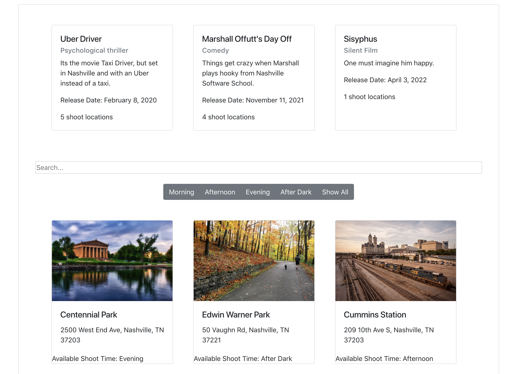
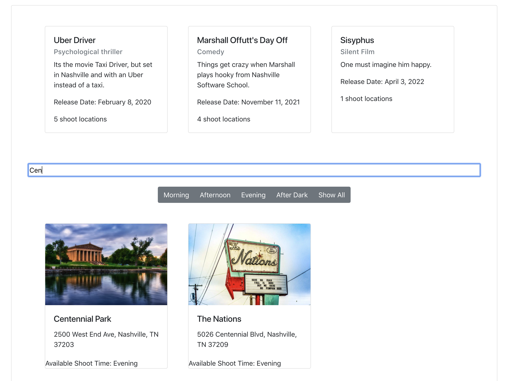
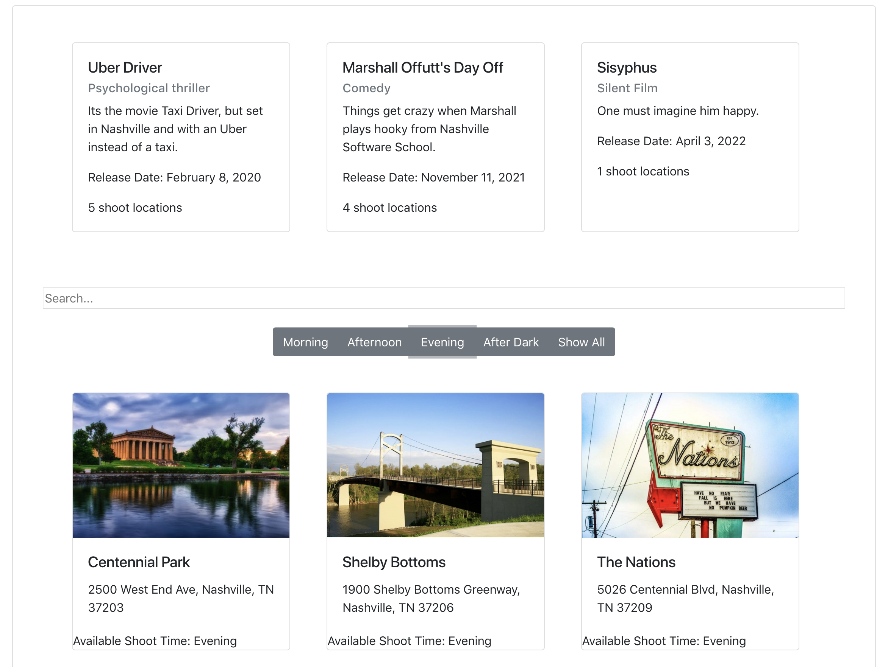
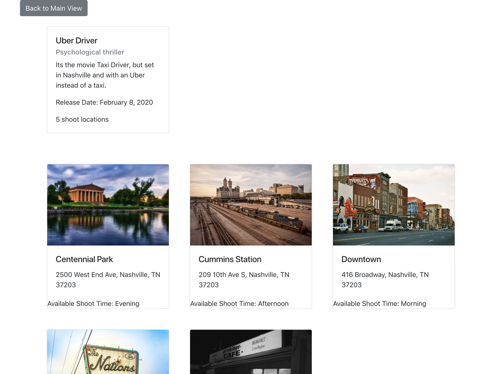

# Shotz

## Description
An app where the user can keep track of all shooting locations for a movie. On page load the user can see 3 fictional movies displayed as cards, and also several possible shooting locations also displayed as cards. The user can click on time of day buttons (morning, afternoon, etc) to filter out locations that correspond to that particular shoot time. The user can also click on a movie card, and doing so will cause all shooting locations NOT associated with that movie to disappear from the dom.

This was a fiarly intensive exercise where we use jQuery, AJAX, filters, event listeners. 

## Screenshots
### Normal view

### Search bar in action

### Filter button example

### Click movie view

## How to Run 
1. Go to: `https://www.npmjs.com/package/http-server` and install "http-server".  
2. Navigate to the project folder in command line interface and type: `http-server -p 8080`  
3. This will show at: `http://localhost:8080` in your internet browser.  

## Notes
I intend to re-code this entire project in a [new repo](https://github.com/marshalloffutt/webpack-shotz), and use webpack, Firebase, and CRUD methods so that the user can add/edit/delete their own shooting locations, or movies should they choose to do so. 
