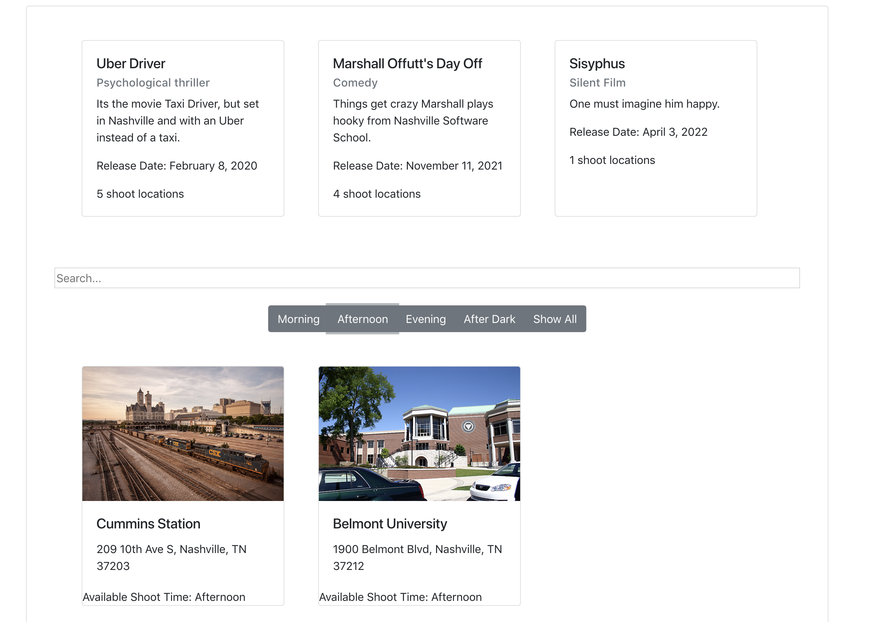
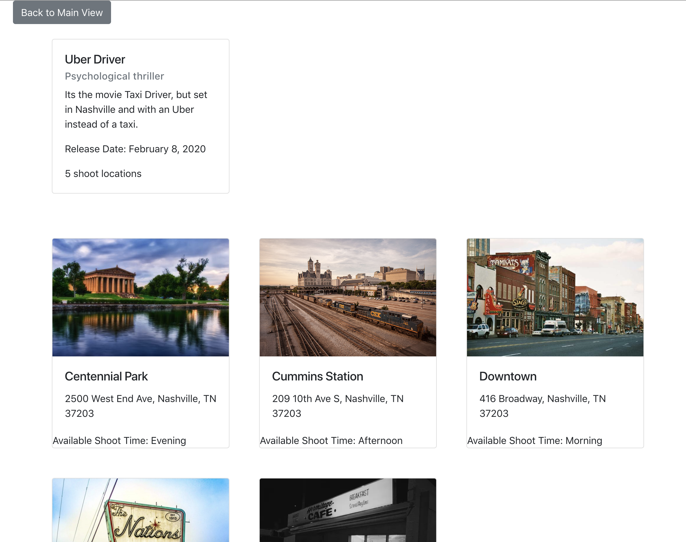

# Shotz

## Description 
An exercise where we use jQuery to create an movie locations app that uses AJAX, filters, event listeners to isolate locations for a movie shoot.

## Technologies Used
> * HTML5
> * CSS
> * Javascript
> * Bootstrap 4

## Screenshots
### Normal view


### Search bar in action


### Filter button example


### Click movie view



## How to Run 
```
1. Go to: `https://www.npmjs.com/package/http-server` and install "http-server".  
2. Navigate to the project folder in command line interface and type: `http-server -p 8080`  
3. This will show at: `http://localhost:8080` in your internet browser.  
```